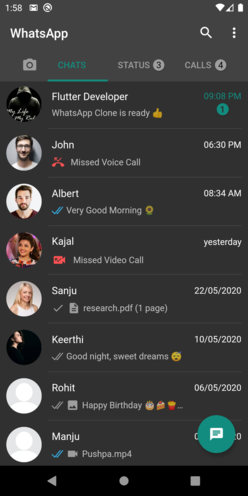

# whatsapp_template

Building a WhatsApp Clone in flutter

# Screenshots

 &emsp; 
 
 chat_light_theme &emsp;&emsp;&emsp;&emsp;&emsp;&emsp;&emsp;&emsp;&emsp; chat_dark_theme

## Getting Started

For help getting started with Flutter, view our
[online documentation](https://flutter.dev/docs), which offers tutorials,
samples, guidance on mobile development, and a full API reference.
